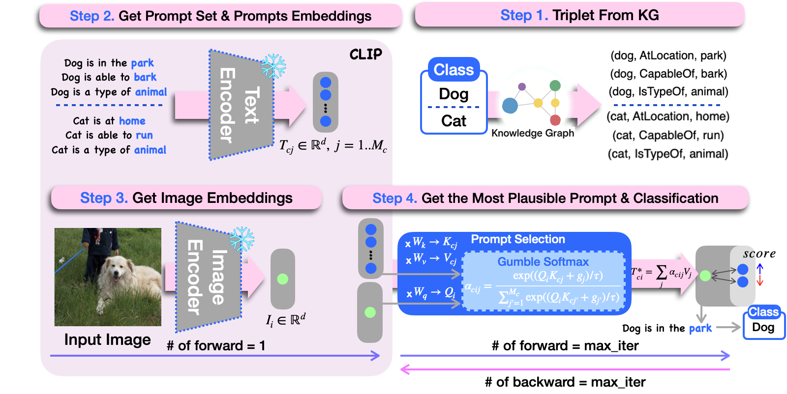

# EPLKG: Efficient Prompt Learning with Knowledge Graph [PAKDD 2026]

[RPLKG: Robust Prompt Learning with Knowledge Graph](https://arxiv.org/abs/2304.10805)

YongTaek Lim, Suho Kang, Yewon Kim, Dokyung Yoon, KyungWoo Song

---

  

